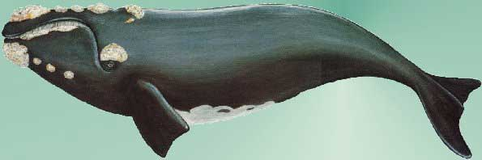

```{=html}
<style>
body {
text-align: justify}
</style>
```
```{r setup, include=FALSE}
knitr::opts_chunk$set(echo = TRUE, warning = FALSE, message = FALSE)
```

# Ocorrências da Baleia Franca Austral

As baleias francas (*Eubalaena australis*) podem ser facilmente
distinguidas dos outros grandes cetáceos por várias características. A
principal delas é a ausência da nadadeira dorsal, característica
exclusiva dentre as baleias que habitam o Hemisfério Sul. Possuem os
orifícios respiratórios bastante separados, originando um vapor
característico em forma de "V" durante a respiração (CUMMINGS, 1985;
EVANS, 1987). Além disso, esta espécie apresentam diversas calosidades
ou "verrugas" na região da cabeça, as quais são utilizadas como
principal caracteristica de identificação destes individuos, pois cada
individuo apresenta um padrão diferente.


<center>
{width="648"}
</center>


Esta espécie apresenta dimorfismo sexual, sendo as fêmeas maiores que os
machos, podendo chegar a 18 metros de comprimento e pesando até 56
toneladas. O período de gestação é de 11 a 12 meses, no qual as fêmeas
tem em média um filhote a cada três anos. Os filhotes nascem com cerca
de 6 metros e pesando 4 a 5 toneladas.

Assim como outras espécies de Mysticetos, *Eubalaena australis* realizam
movimentos de migrações durante o ano, passando o verão na região do
polo Sul se alimentando e migrando para águas mais quentes durante o
inverno, principalmente para desenvolverem atividades de acasalamento e
procriação. Importante ressaltar que esta espécie tem ocorrência
registradas em toda a área do Hemisfério Sul. Já no Hemisfério Norte
tem-se a ocorrência da espécie *Eubalaena glacialis,* a qual sofre
diversos impactos de origem antrópica.

# Coletando Informações de Bancos de Dados Abertos 

## Banco de dados OBIS

Iniciamos instalando os pacotes `dplyr`, `tidyverse` e `robis`. Em
seguida, iniciou-se o download das ocorrências e demais informações
sobre a espécie *E. australis*. Por meio da função `occurrence` fez-se a
busca simples das ocorrências da espécie no repositório OBIS.
```{r pacot}
## carregar pacotes
library(dplyr)
library(tidyverse)
library(robis)

```

Em seguida, os dados foram coletados **17.131** observações com 127
variáveis.
```{r ocorr}
# baixar ocorrências
franca_obis <- robis::occurrence("Eubalaena australis")
#Retrieved 17131 records of approximately 17131 (100%)

```


```{r dad}

# checar dados
names(franca_obis)
```

### Problemas encontrados

Os dados disponíveis em repositórios abertos são repletos de dados oriundos de diversas fontes. Algumas vezes os coletores não conseguem capturar as informações de forma completa ou ocorrem alguns erros inerentes a coleta ou inserção destes dados nos repositórios.

Devido a elevada quantidade de informações se faz necessária a seleção das variáveis que possam ser utilizadas para a análise. Nesse sentido, foram selecionadas as seguintes variáveis: **scientificName, decimalLatitude, decimalLongitude, bathymetry, flags, waterBody, basisOfRecord, occurrenceStatus, rightsHolder,datasetName, recordedBy, depth, locality, date_year, individualCount, year, sex**.  
```{r var}
##Selecionar variáveis
franca_obis1 <- franca_obis %>% 
  dplyr::select(scientificName, decimalLatitude, decimalLongitude, bathymetry,
                flags, waterBody, basisOfRecord, occurrenceStatus, rightsHolder,
                datasetName, recordedBy, depth, locality, date_year, individualCount, sex) %>%
  distinct()
```

Desse modo, os dados foram reduzidos a **12.136** observações dentre as 17 variáveis selecionadas. A fim de manter-se a qualidade das informações, precisamos verificar os possiveis problemas com os dados. Importante observar que neste repositório os problemas reportados são denominados de `flags`.
```{r flags}

# check problemas reportados (flags)
franca_obis1 %>% 
  distinct(flags)
```

```{r dataset}
#check NA em datasetName
franca_obis1 %>% 
  filter(!flags %in% c("ON_LAND,NO_DEPTH", "no_depth,on_land", "depth_exceeds_bath,on_land", "on_land,no_depth", "on_land", "on_land,depth_exceeds_bath", "ON_LAND", "ON_LAND,DEPTH_EXCEEDS_BATH"),
         is.na(datasetName)) %>% 
  distinct(waterBody)
```

As `flags` foram utilizadas para filtrar ocorrências da nossa espécie em terra e remover do nosso conjunto de dados os dataset que não apresentaram informações (NA). Além disso, aplicamos um filtro para remover a duplicidade de ocorrências e plotamos um gráfico verificando uma linha do tempo dos relatos da baleia franca austral:
```{r depht}
#depth ok
franca_obis1 %>% 
  filter(!flags %in% c("ON_LAND,NO_DEPTH", "no_depth,on_land", "depth_exceeds_bath,on_land", "on_land,no_depth", "on_land", "on_land,depth_exceeds_bath", "ON_LAND", "ON_LAND,DEPTH_EXCEEDS_BATH"),
         !is.na(datasetName),
         !waterBody %in% c("world","Global,French EEZ")) %>%
  ggplot(aes(x = date_year, fill = waterBody)) +
  geom_histogram() 

  # checar niveis
franca_obis1 %>% 
    filter(!flags %in% c("ON_LAND,NO_DEPTH","no_depth,on_land","depth_exceeds_bath,on_land","on_land,no_depth", "on_land", "on_land,depth_exceeds_bath", "ON_LAND", "ON_LAND,DEPTH_EXCEEDS_BATH"),
           !is.na(datasetName),
           !waterBody %in% c("world","Global,French EEZ")) %>% 
    lapply(., unique)
```

```{r filtro}
# filtro final
franca_obis2 <- franca_obis1 %>% 
  filter(!flags %in% c("ON_LAND,NO_DEPTH","no_depth,on_land","depth_exceeds_bath,on_land","on_land,no_depth", "on_land", "on_land,depth_exceeds_bath", "ON_LAND", "ON_LAND,DEPTH_EXCEEDS_BATH"),
         !is.na(datasetName),
         !waterBody %in% c("world","Global,French EEZ"))
```

O primeiro mapa refere-se ao conjunto de dados `franca_obis1`, antes da aplicação do filtro final e remoção das `flags`sinalizadas. 
```{r mapa 1}
# baixar mapa do mundo
world <- map_data('world')

# plotar mapa franca obis 1
ggplot() +
  geom_polygon(data = world, aes(x = long, y = lat, group = group)) +
  coord_fixed() +
  theme_classic() +
  geom_point(data = franca_obis1, aes(x = decimalLongitude, y = decimalLatitude, color = waterBody)) +
  #theme(legend.title = element_blank()) +
  labs(x = "longitude", y = "latitude", title = expression(italic("Eubalaena australis")))
```

O segundo mapa contém menos observações (1020) e apresenta uma ocorrência mais pontual dos especimes ao longo do Hemisfério Sul. 
```{r mapa 2}
# plotar mapa franca obis 2
ggplot() +
  geom_polygon(data = world, aes(x = long, y = lat, group = group)) +
  coord_fixed() +
  theme_classic() +
  geom_point(data = franca_obis2, aes(x = decimalLongitude, y = decimalLatitude, color = waterBody)) +
  #theme(legend.title = element_blank()) +
  labs(x = "longitude", y = "latitude", title = expression(italic("Eubalaena australis")))
```

## Banco de dados GBIF

Para coletarmos informações deste repositório precisamos do pacote `rgbif`. 

```{r pacote}
##Instalando pacote rgbif##
library(rgbif)
```

Em seguida, iremos baixar as ocorrências da nossa espécie que constam no repositório GBIF para que possamos realizar os passos de limpeza dos dados. 

```{r ocorrencias gbif}
# baixar ocorrencias
franca_gbif <- occ_data(scientificName = "Eubalaena australis", 
                        hasCoordinate = TRUE,
                        hasGeospatialIssue=FALSE)
```

```{r dim}
## dimensoes

dim(franca_gbif)

dim(franca_gbif$data)
```

``` {r dados}
# checar campos
franca_gbif$data %>% names
```

Após checar os dados iremos observar quais os principais `issues`informados pelo repositório. Esta estapa nos auxiliará na filtragem dos dados.

```{r issues}
# Checar issus

gbif_issues()
```

```{r issues franca}
# checar os issues individuais da espécie
issues_gbif <- franca_gbif$data$issues %>%
  # unique() %>%
  strsplit(.,"[,]") %>%
  unlist() %>%
  unique()

issues_gbif
```

O próximo passo é selecionar os campos de interesse para reduzirmos a quantidade de dados a serem analisados.

```{r select}
# selecionar campos de interesse
franca_gbif1 <- franca_gbif$data %>%
  dplyr::select(scientificName, decimalLatitude, decimalLongitude,issues,
                basisOfRecord, sex, rightsHolder,continent, year, month, day, 
                datasetName, recordedBy, waterBody, country, iucnRedListCategory, countryCode, depth)
```

Nosso conjunto de dados `franca_gbif1`contêm 500 observações, distribuidas em 18 variáveis. No entanto, algumas observações podem estar duplicadas, para garantir a qualidade dos dados iremos selecionar as ocorrências únicas.

```{r occor unic}
# ocorrencias únicas
franca_gbif1 <- franca_gbif1 %>% 
  distinct()
```

Observe agora que as observações foram reduzidas para 222. Prosseguindo com as análises iremos investigar os níveis suspeitos.

```{r niveis}
# checar niveis dos fatores
lapply(franca_gbif1, unique)

# investigar niveis suspeitos
franca_gbif1 %>% 
  distinct(country) %>% 
  pull()
```

```{r plot c}
# country
franca_gbif1 %>%
  group_by(country) %>% 
  summarise(occ = length(scientificName)) %>% 
  ggplot(aes(occ, y=country)) +
  geom_bar(stat = 'identity')
```

A maioria das ocorrências registradas neste repositório foram na **Argentina** e **Australia**. 

A fim de compreender melhor a distribuição de *Eubalaena australis* iremos unificar as ocorrências dos dois repositórios analisados: OBIS e GBIF. 
Antes precisaremos descobrir as diferenças entre as variáveis:

```{r unif}
# unir GBIF e OBIS

# ver diferencas
setdiff(names(franca_gbif1), names(franca_obis2))
setdiff(names(franca_obis2), names(franca_gbif1))
```

```{r unificar}
# juntar os dados
franca_big <- bind_rows(franca_gbif1 %>% 
                        mutate(repo = paste0("gbif", row.names(.))), 
                      franca_obis2 %>% 
                        mutate(repo = paste0("obis", row.names(.)))) %>%
  column_to_rownames("repo") %>% 
  dplyr::select(decimalLongitude, decimalLatitude, depth) %>% 
  distinct() %>% 
  rownames_to_column("occ") %>% 
  separate(col = "occ", into = c("datasetName", "rn"), sep = 4) %>%
  mutate(scientificName = "Eubalaena australis") %>% 
  dplyr::select(-rn)
```

Nosso conjunto de dados unificado foi nomeado de `franca_big`. Nele constam 1130 observações com 5 variáveis. Vamos agora mapear a distribuição da nossa espécie por meio da latitude. 

```{r latit}
# mapear ocorrencias pela latitude
franca_big %>% 
  mutate(lat = round(decimalLatitude)) %>% 
  group_by(lat, scientificName) %>%
  summarise(occ = length(scientificName)) %>%
  ggplot(aes(y = occ, x = lat, color = scientificName)) +
  geom_point() +
  geom_smooth() +
  theme_classic() +
  labs(x = "latitude", y = 'ocorrências')
```
Podemos observar que não temos nenhuma ocorrência de *Eubalaena australis* acima de latitude -20º. Isso corrobora com a distribuição restrita desta espécie para o Hemisfério Sul, tendo sua maior concentração nas latitudes menores que -40º. 

# Aplicação de gráficos interativos

Os gráficos interativos permitem uma melhor observação dos pontos de ocorrência, além de se apresentar como um atrativo a mais para o site. Para se utilizar esta funcionalidade deve-se carregar o pacote `leaflet`
```{r packge}
library(leaflet)
```

```{r mapa inter}
# conferir no mapa
pal <- colorFactor(palette = "viridis", domain = unique(franca_big$datasetName))
franca_big %>% 
  leaflet() %>% 
  addTiles() %>% 
  addCircleMarkers(~decimalLongitude,
                   ~decimalLatitude,
                   radius = 4,
                   label = ~as.character(datasetName),
                   color = ~pal(franca_big$datasetName),
                   stroke = FALSE, fillOpacity = 0.6)%>%
  addLegend('bottomright', 
          colors = unique(pal(franca_big$datasetName)), 
          labels = unique(franca_big$datasetName),
          title = 'Bases de Dados',
          opacity = 0.6)
```

Acima temos um exemplo com os dados unificados sobre nossa espécie alvo (dois repositórios). Podemos obsrrvar que alguns pontos de ocorrência se sobrepõem.
Deste ponto em diante iremos utilizar os dados `franca_obis2`que apresentam maior quantidade de observações. 

```{r map obis2}
# conferir no mapa OBIS 2
 pal2 <- colorFactor(palette = "viridis", domain = unique(franca_obis2$individualCount))

 franca_obis2 %>% 
   leaflet() %>% 
   addTiles() %>% 
   addCircleMarkers(~decimalLongitude,
                    ~decimalLatitude,
                    radius = 4,
                    label = ~as.character(locality),
                    color = ~pal2(franca_obis2$individualCount),
                    stroke = FALSE, fillOpacity = 0.6)%>%
   addLegend('bottomright', 
             colors = unique(pal2(franca_obis2$individualCount)), 
             labels = unique(franca_obis2$individualCount),
             title = 'Nº Indivíduos',
             opacity = 0.6)
```

Neste mapa classificamos os pontos de ocorrência pela quantidade de indivíduos ao longo de toda a distribuição de *Eubalaena australis*. 

Outros gráficos podem ser elaborados utilizando a função `Plotly` para melhorar a interação entre as informações e apresentar mais funcionalidades aos gráficos, como no exemplo abaixo:

```{r plot graf}
#plotar ocorrências ao longo do tempo

library(plotly)

fr <- franca_obis2 %>% 
  mutate(date = round(date_year)) %>% 
  group_by(date, waterBody) %>%
  summarise(occ = length(scientificName)) %>%
  ggplot(aes(y = occ, x = date, color = waterBody)) +
  geom_point() +
  theme_classic() +
  labs(x = "Anos", y = 'Ocorrências')

ggplotly(fr)
```

O pacote `ggplot`nos fornece a possibilidade de criarmos um gráfico animado. Sendo assim, utilizamos os dados do repositório OBIS e plotamos uma serie temporal de ocorrência da baleia franca austral, informando também dados como a profundidade e latitude de ocorrência:

```{r animação}
#grafico animado
gg <- ggplot(franca_obis2, aes(decimalLatitude, waterBody, color= bathymetry)) +
  geom_point(aes(frame = date_year, ids=locality))
  
ggplotly(gg)
```

*Enfim, compartilhe os dados e façamos o melhor para a ciência, meio ambiente e a sociedade.*

<center>
{width="648"}
</center>